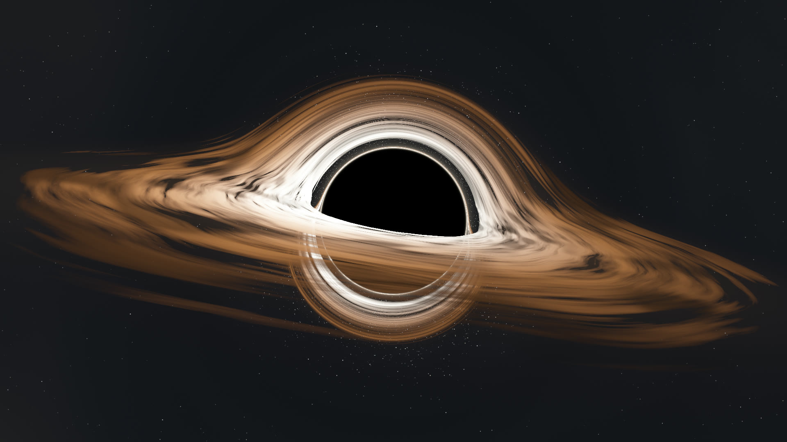

# Black Hole Wallpaper

A live black hole wallpaper for GNOME, rendered on the GPU.

Light rays bend around the black hole, so the far side of the disk shows up above and below it. The disk spins, stars twinkle, and the camera turns toward your cursor.



## Features

- Real-time ray tracing of light around a black hole, in a GLSL shader.
- Moving the cursor turns the camera. The camera eases after it.
- Rendered once per frame and shared by the desktop, the overview and the workspace switcher.
- Pauses while a maximized or fullscreen window covers the monitor.
- Works with several monitors, each with its own view.
- Draws at a lower resolution and scales up, to save GPU time.

## Requirements

GNOME Shell 50.

## Install

```sh
git clone https://github.com/include5691/gnome_black_hole_live_wallpaper_extension.git
cd gnome_black_hole_live_wallpaper_extension
make install
```

Log out and back in, because Wayland cannot reload GNOME Shell in place. Then enable it:

```sh
gnome-extensions enable black-hole-wallpaper@include5691.github.io
```

**Update:** `git pull && make install`, then log out and back in.

**Uninstall:**

```sh
gnome-extensions disable black-hole-wallpaper@include5691.github.io
make uninstall
```

## Settings

```sh
gnome-extensions prefs black-hole-wallpaper@include5691.github.io
```

| Setting | Default | Range |
| --- | --- | --- |
| Resolution | 50 % | 25 – 100 |
| Frame rate | 30 fps | 5 – 60 |
| Quality | medium | low, medium, high |
| Pause behind windows | on | |
| Follow cursor | on | |
| Sensitivity | 50 % | 0 – 100 |
| Smoothness | 40 % | 0 – 100 |
| Rotation speed | 100 % | 0 – 400 |
| Camera height | 8° | -30 – 60 |
| Tilt | 9° | -45 – 45 |
| Zoom | 100 % | 50 – 200 |
| Brightness | 100 % | 25 – 400 |
| Doppler effect | 40 % | 0 – 100 |

## Performance

GPU time per frame on an Intel Arc B390, 3120×2080 screen at 50 % resolution:

| Quality | Time |
| --- | --- |
| low | 1.7 ms |
| medium | 2.2 ms |
| high | 3.0 ms |

At 30 fps and medium quality that is about 7 % of the GPU.

## How it works

1. Each `Meta.BackgroundActor` gets a child actor that covers it.
2. The child shows a `Clutter.Content` shared by every background on the same monitor.
3. A timer marks the content dirty. On the next paint it draws the shader into an offscreen texture once.
4. The shader steps each light ray through the bending of space, finds where it crosses the disk, and colors the disk with noise, heat and Doppler shift.
5. Each background draws the texture scaled up, with the rounded corners the overview uses.

## Development

| File | Purpose |
| --- | --- |
| `extension.js` | Hooks into backgrounds, timer, settings, window cover check |
| `renderer.js` | Offscreen rendering, camera and cursor easing |
| `shader.js` | The GLSL shader |
| `prefs.js` | Preferences window |
| `schemas/` | GSettings schema |

Build a zip for extensions.gnome.org with `make pack`.

Watch the logs:

```sh
journalctl -f -o cat /usr/bin/gnome-shell
```

## License

[GPL-2.0-or-later](LICENSE)
