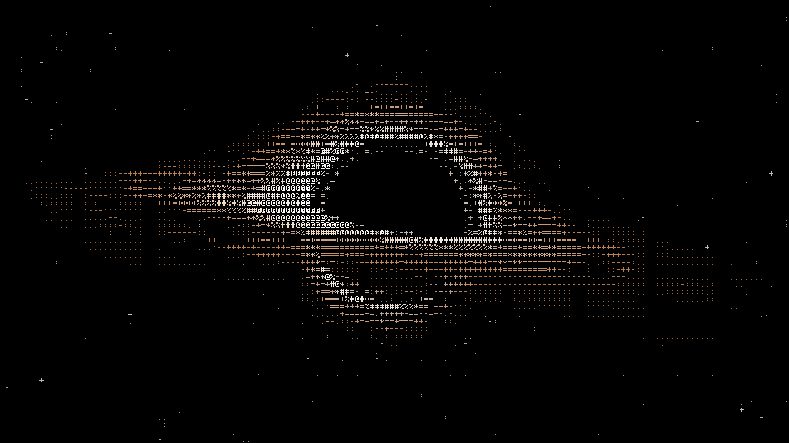
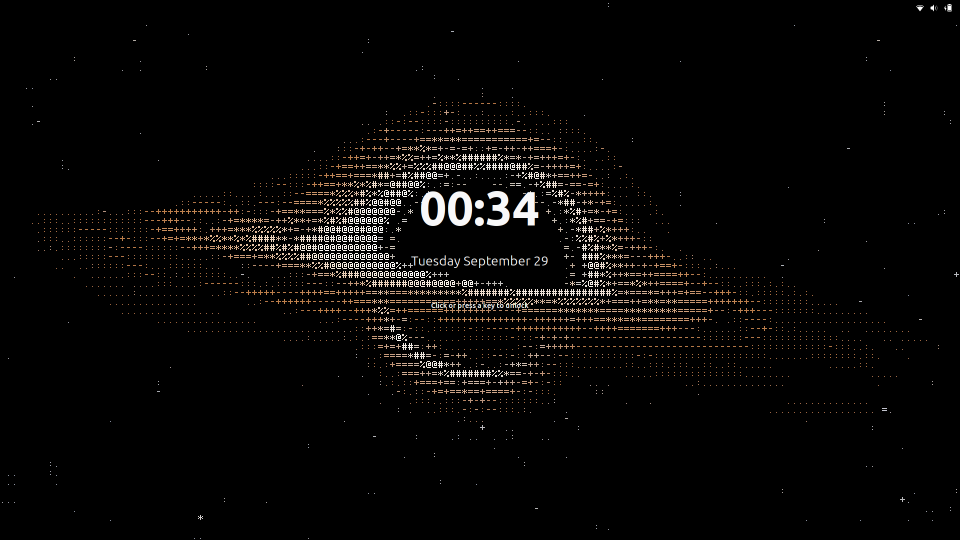

# Space Wallpaper

A live ASCII-art space wallpaper for GNOME, rendered on the GPU: black holes, neutron stars, stars and wormholes.

Light rays bend around the black hole, so the far side of the disk shows up above and below it. The scene is drawn as colored ASCII characters. The disk spins, stars twinkle, and the camera turns toward your cursor. The lock screen shows the same black hole as a still image.





## Features

- Real-time ray tracing of light around a black hole, in a GLSL shader.
- Drawn as ASCII characters in the scene's own colors, from ` .:-+=*%#@`.
- Nine object types:
  - a spinning black hole with an accretion disk. Spin drags space around it, which squashes the shadow into a D shape, and pulls the disk's inner edge closer, following the Kerr ISCO;
  - a lone neutron star (pulsar) with rotating hot spots and sweeping beams, and no disk, like most real pulsars;
  - a Sun-like star with limb darkening, granulation, sunspots and a corona;
  - a wormhole: its mouth bends light like a black hole, and through its throat you see another universe with a spinning spiral galaxy;
  - a ringed planet: a banded gas giant with a storm, lit by a sun, with rings that it shadows and that shadow it, and three moons on tilted orbits. Next to a star, it is lit by that star;
  - Earth: real continents from a world map, oceans with sun glint, drifting clouds, polar ice, a blue atmosphere, city lights and green auroras on the night side, the Moon with dark maria, the ISS and a Starlink train;
  - a quasar, shown alone: a giant black hole with a hot blue-white disk, jets with bright knots far longer than the disk, and a faint host galaxy;
  - a Dyson swarm, shown alone: a Sun-like star circled by six tilted rings of solar collectors. Their sunlit faces glint on the far side, their dark backs cross the star's face, and a few panels are still missing;
  - the Crab Nebula, shown alone: a pulsar inside a blue synchrotron glow with red and yellow filaments, a bright inner ring, polar jets and ripples that run outward.
- A deep sky mode:
  - a spiral galaxy with a yellow bulge, blue trailing arms and pink star-forming knots, turning slowly;
  - two spiral galaxies colliding: a real gravity simulation of thousands of stars. They swing past each other, throw out long tidal tails, fall back and merge, then it starts again;
  - a globular star cluster: 16,000 old stars packed into a bright core, with orange giants and blue stragglers, slowly orbiting;
  - the Pillars of Creation in the Eagle Nebula, drawn from the 2014 Hubble photo: three dust columns with gold-rimmed heads and dark brown trunks, rising out of mist in front of a distant teal oxygen haze. The columns are solid 3D bodies grown from the photo's outlines, so they turn as real objects when the camera moves while the haze stays far behind. Their rims shimmer, gas boils off the tips and the bright stars twinkle;
  - the Big Bang: the history of the universe in 3 minutes. A tiny point flashes, space inflates into white-hot plasma that churns and cools to red, the fog clears into the cosmic microwave background, the dark ages pass, the first stars ignite, thousands of galaxies gather into the filaments of the cosmic web, and the camera settles on a spiral galaxy under today's stars. Then it starts again;
  - the birth of the solar system, 4.6 billion years ago, in 3 minutes. A massive sibling star explodes and its shock wave squeezes a cold, dark cloud of gas and dust and seeds it with radioactive aluminium-26. The cloud collapses from the inside out, spins up and flattens into a disk around a hidden orange protostar that fires jets from its poles and carves cavities in the cloud. Dust settles into rock inside the frost line and ice outside it, and the frost line creeps inward as the disk cools. Jupiter forms first and clears a gap, then Saturn, Uranus and Neptune; Mars is done early. The young Sun's X-ray and UV light boil the outer gas away while the inner gas falls onto the Sun, which shrinks and settles into steady hydrogen burning. Mercury, Venus and Earth grow from colliding rocks, Theia hits the young Earth and the debris forms the Moon, and the leftovers stay as the asteroid and Kuiper belts. Then it starts again;
  - the solar system: eight planets with their own looks, faint orbit lines, an asteroid belt and Saturn's rings. The Moon circles Earth, four moons circle Jupiter and Titan circles Saturn. Their shadows cross the planets, and they go dark in the planets' shadows. The center is any object you pick: the Sun, a black hole, a neutron star or a wormhole. The center lights everything; a black hole, neutron star or wormhole also bends the light. Planet names can be shown in the same pixel font.
    - with Cosmic events on, the solar system reacts to its center:
      - a black hole pulls the planets in one by one and tears each planet and its moons into a cloud of fragments. The fragments swirl around it, heat up, feed its disk or fly away, then the system starts again;
      - a wormhole is lighter than the Sun, so the planets escape on real gravity paths and fly apart into space, then the system starts again;
      - a neutron star is heavier than the Sun, so the planets keep orbiting, but its pulsar wind blows glowing tails off every planet.
- Real time: Earth's day and night follow the real clock and season, the Moon shows today's phase, and the solar system planets sit where they really are today.
- Three skies: the Milky Way, a glowing band with dust lanes and a bright core; a pink and teal emission nebula with dark dust; or plain stars. All are bent by every black hole, neutron star and wormhole.
- A single star lives out one of two real fates, taking turns:
  - planetary nebula: it swells into a red giant, then puffs off a glowing ring nebula, teal inside and red outside, around a tiny blue-white dwarf;
  - supernova: it swells, collapses, explodes in a flash, and leaves a newborn pulsar inside an expanding filament nebula.
- A single neutron star with Cosmic events on is a magnetar: its twisted magnetic loops glow brighter, then a giant flare cracks the crust, shakes the star, flashes and sends out a shockwave.
- Pair mode shows two objects orbiting each other, with light bent by every black hole and neutron star. Pick any combination.
- Pairs play out a cosmic event, then fade and start again:

  | Pair | Event |
  | --- | --- |
  | Two black holes | They spiral in, sending gravitational waves across a glowing spacetime sheet, then merge in a flash with a shockwave ring. The new black hole rings down and grows a disk. |
  | Black hole or neutron star and a star | A stream of gas pours from the star into the compact object. The star stretches, then breaks into a cloud of hot gas that swirls around, feeds the disk and partly escapes. A black hole then fires jets; a neutron star's pulsar beams blaze brighter. |
  | Black hole and Earth | The Earth stretches, then breaks into a cloud of rock, water and ice together with its Moon. The fragments follow real gravity: some heat up and fall into the disk, others are flung away, and the black hole fires jets. |
  | Black hole and a ringed planet | The planet and its rings stretch, then break into a cloud of gas and ice together with its three moons. The ring fragments keep circling, then swirl into the disk or fly away, and the black hole fires jets. |
  | Two neutron stars | They spiral in and merge: a gamma-ray-burst jet, a shockwave, and a kilonova cloud of fresh heavy elements that cools from blue to red around the new black hole. |
  | Black hole and neutron star | They spiral in, the neutron star is torn apart and swallowed, and the black hole fires jets. |
  | Two stars, or any other pair with a wormhole, a planet or Earth | A calm orbit. |

  Speed sets how fast orbits and events play. A black hole event takes about 2 minutes at 100 %. Turn off Cosmic events for calm scenes only.
- Moving the cursor turns the camera. The camera eases after it.
- Zoom in and out on the desktop by pinching with two fingers on a touchpad.
- Super+Ctrl+scroll zooms from anywhere, with the mouse wheel or two fingers on a touchpad. Plain scrolling on an empty desktop also zooms, but not while a desktop icons extension covers the wallpaper.
- The zoom is saved.
- Rendered once per frame and shared by the desktop, the overview and the workspace switcher.
- Pauses while a maximized or fullscreen window covers the monitor.
- Works with several monitors, each with its own view.
- The lock screen shows a still, unblurred view.

## Requirements

GNOME Shell 50.

## Install

```sh
git clone https://github.com/include5691/gnome_space_live_wallpaper_extension.git
cd gnome_space_live_wallpaper_extension
make install
```

Log out and back in, because Wayland cannot reload GNOME Shell in place. Then enable it:

```sh
gnome-extensions enable space-wallpaper@include5691.github.io
```

**Update:** `git pull && make install`, then log out and back in.

**Uninstall:**

```sh
gnome-extensions disable space-wallpaper@include5691.github.io
make uninstall
```

## Settings

```sh
gnome-extensions prefs space-wallpaper@include5691.github.io
```

| Setting | Default | Range |
| --- | --- | --- |
| Mode | single | single, pair, deep sky |
| Black hole spin | 60 % | 0 – 99 |
| Object (single) | black hole | black hole, neutron star, star, wormhole, ringed planet, Earth, quasar, Dyson swarm, Crab Nebula |
| First object (pair) | black hole | black hole, neutron star, star, wormhole, ringed planet, Earth |
| Second object (pair) | black hole | black hole, neutron star, star, wormhole, ringed planet, Earth |
| Center (deep sky solar system) | Sun | Sun, black hole, neutron star, wormhole |
| Object (deep sky) | spiral galaxy | spiral galaxy, galaxy collision, star cluster, Pillars of Creation, Big Bang, solar system birth, solar system |
| Planet names (solar system) | off | |
| Real time (Earth, solar system) | off | |
| Speed | 100 % | 0 – 400, orbits and cosmic events |
| Cosmic events | on | |
| Frame rate | 30 fps | 5 – 60 |
| Pause behind windows | on | |
| Follow cursor | on | |
| Sensitivity | 50 % | 0 – 200 |
| Smoothness | 40 % | 0 – 100 |
| Background | Milky Way | Milky Way, stars, nebula; the Big Bang uses its own sky |
| Character size | 3 | 1 – 8 |
| Disk rotation speed | 100 % | 0 – 400 |
| Camera height | 8° | -30 – 60 |
| Tilt | 9° | -45 – 45 |
| Zoom | 100 % | 25 – 400 |
| Brightness | 100 % | 25 – 400 |
| Doppler effect | 40 % | 0 – 100 |

## Performance

GPU time per frame on an Intel Arc B390 with a 3120×2080 screen and the default character size:

| Scene | Time |
| --- | --- |
| One object | 0.6 – 1.8 ms |
| A pair, including events | 0.8 – 2.0 ms |
| Solar system | 1.1 – 1.4 ms |

At 30 fps that is 2 – 6 % of the GPU. The Milky Way adds about 0.3 ms.

Deep sky mode also moves its stars on the CPU: about 3 ms per frame and monitor on a 1560×1040 screen with character size 1.

The shader is compiled only with the parts the current scene needs, so the first frame after login or after changing the scene compiles in 0.2 – 1 s instead of about 6 s. Mesa caches the result, so later logins with the same settings skip it.

## How it works

1. Each `Meta.BackgroundActor` gets a child actor that covers it.
2. The child shows a `Clutter.Content` shared by every background on the same monitor.
3. A timer marks the content dirty. On the next paint it renders two offscreen passes once.
4. The scene pass is built for the current scene: only the objects, effects and sky it uses are compiled in. It traces 2×2 light rays per character cell. Each ray is stepped through the bending of space around every black hole and neutron star, and the pass finds where it crosses a disk. The disks are colored with noise, heat and Doppler shift. A neutron star has a glowing surface and two pulsar beams along its tilted, spinning magnetic axis. A star's own light bending is too small to see, so rays pass it straight until they hit its surface.
5. In deep sky mode, the CPU moves the stars, projects them onto the character grid and uploads their light as a small texture that the scene pass adds.
6. The ASCII pass picks a character for each cell by brightness and draws it from a 5×7 bitmap font, in the cell's color.
7. Each background draws the result, with the rounded corners the overview uses.
8. While the screen is locked, the timer stops and the camera resets to the default view. The lock screen blur is turned off.

## Development

| File | Purpose |
| --- | --- |
| `extension.js` | Hooks into backgrounds, timer, settings, window cover check, lock screen |
| `renderer.js` | Offscreen passes, camera and cursor easing, galaxy star splatting |
| `events.js` | Object layout, orbits, lighting, pair events, the star life cycles and the magnetar |
| `galaxy.js` | Spiral galaxy, galaxy collision, star cluster and Pillars of Creation particles |
| `cosmos.js` | Big Bang timeline, first stars, cosmic web and the forming galaxy |
| `birth.js` | Solar system birth timeline, collapsing cloud, disk, planet growth and the Moon-forming impact |
| `debris.js` | Tidal disruption fragments that orbit, heat up, feed the disk or escape |
| `sky.js` | Sun, Moon and planet positions for real time |
| `shader.js` | Scene and ASCII GLSL shaders |
| `earthmap.js` | 256×128 land mask of the Earth |
| `pillarmap.js` | Pillars of Creation colors, thickness and haze from the Hubble photo |
| `prefs.js` | Preferences window |
| `schemas/` | GSettings schema |

Build a zip for extensions.gnome.org with `make pack`.

Watch the logs:

```sh
journalctl -f -o cat /usr/bin/gnome-shell
```

## Credits

The Earth's coastlines come from [Natural Earth](https://www.naturalearthdata.com/) 1:110m land, which is in the public domain.

The Pillars of Creation come from the 2014 Hubble photo [heic1501a](https://esahubble.org/images/heic1501a/) by NASA, ESA/Hubble and the Hubble Heritage Team, under [CC BY 4.0](https://creativecommons.org/licenses/by/4.0/).

## License

[GPL-2.0-or-later](LICENSE)
